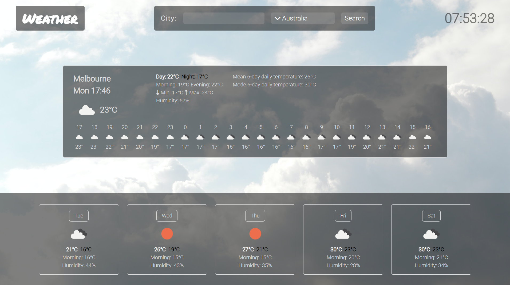

# Weather

One-page weather React App created with OpenWeatherMap API. 

#### Tools & technologies:
* React.JS (router, scroll, countup, paginate, visibility-sensor)
* JavaScript
* HTML/CSS/Sass
* Firebase

#### In progress:
* responsiveness
* give-away form validation
* firebase login n timeout
* forgot password? component

### Check it out here:

